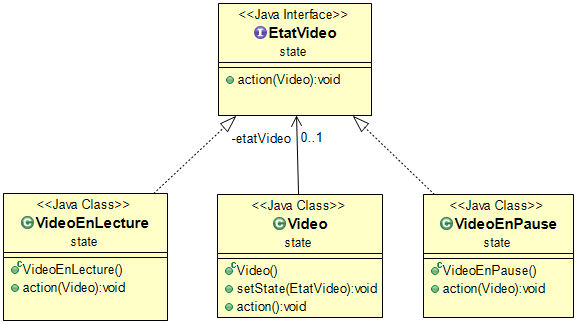

# Pourquoi la famille des patterns comportementaux ?

L'une des raisons principales est que le pattern State est utilisé pour **changer le comportement** d'un objet sans toucher à son instanciation.


# Passons à un exemple

Imaginons que nous souhaitons coder un lecteur vidéo très simple. Ce lecteur pourra uniquement lire une vidéo ou la mettre en pause.
Nous voyons donc facilement qu'il n'y que deux états différents possible pour une vidéo dans ce logiciel: 
- **Lecture**
- **Pause**

Evidemment, nous pourrions coder ce programme de cette manière :
``` java runnable 
class Video {

	private String etat="";

	public void setEtat(String etat){
		this.etat=etat;
	}

	public void action(){
		if(etat.equalsIgnoreCase("PLAY")){
			System.out.println("La vidéo est en lecture");
		}else if(etat.equalsIgnoreCase("PAUSE")){
			System.out.println("La vidéo est en pause");
		}
	}
}
public class Main{
	public static void main(String args[]){
		Video video = new Video();

		video.setEtat("PLAY");
		video.action();

		video.setEtat("PAUSE");
		video.action();
	}
}
```

## Maintenant on code ce lecteur à l'aide du pattern State

Tout d'abord on crée une interface nommée EtatVideo de cette forme:

``` java
interface EtatVideo {
    void action(Video context);
}
```

Ensuite on crée nos deux états qui implémente l'interface EtatVideo:

Donc pour **lecture** on crée VideoEnLecture
``` java
class VideoEnLecture implements EtatVideo {

	@Override
	public void action(Video context) {
		System.out.println("La vidéo est en lecture");
		
	}

}
```

Et pour **pause** on crée VideoEnPause
``` java
class VideoEnPause implements EtatVideo {

	@Override
	public void action(Video context) {
		System.out.println("La vidéo est en pause");	
	}
}
```

Enfin on crée la classe Video qui va permettre de modifier l'état de la vidéo
``` java
class Video {
	private EtatVideo etatVideo;
	
    public void setState(EtatVideo newEtat) {
        this.etatVideo = newEtat;
    }

    public void action() {
    	etatVideo.action(this);
    }
}
```
On teste maintenant le programme avec les mêmes actions que précedemment
``` java runnable 
interface EtatVideo {
    void action(Video context);
}

class Video {
	private EtatVideo etatVideo;
	
    public void setState(EtatVideo newEtat) {
        this.etatVideo = newEtat;
    }

    public void action() {
    	etatVideo.action(this);
    }
}


class VideoEnPause implements EtatVideo {

	@Override
	public void action(Video context) {
		System.out.println("La vidéo est en pause");	
	}
}


class VideoEnLecture implements EtatVideo {

	@Override
	public void action(Video context) {
		System.out.println("La vidéo est en lecture");
		
	}

}


public class Main {
    public static void main(String[] args) {
        Video video = new Video();
        video.setState(new VideoEnLecture());
        video.action();
        video.setState(new VideoEnPause());
        video.action();
    }
}
```
On observe que le résultat est identique. Heureusement!


## On obtient le diagramme de classe suivant




# Pourquoi utiliser le Design Pattern State

Après avoir testé la méthode classique et celle utilisant le pattern State, on est en droit de se demander **quel peut être l'intérêt d'utiliser le pattern State**. En effet, il va **nécessiter de créer plus de classe et donc d'écrire plus de code pour au final le même résultat**.

Et bien le pattern State va permettre au code d'évoluer très facilement!

Si nous décidons d'ajouter une fonctionnalité **retour au début de la vidéo**, avec la méthode classique, **nous devrions rajouter une condition dans la méthode action de la classe Video**. Or, avec le design pattern State, nous ne touchons pas au code existant!
** Nous rajoutons simplement la classe RetourAuDebut qui implémente EtatVideo**

## Création de la classe RetourAuDebut
Cette classe pourrait se coder ainsi:
``` java
class RetourAuDebut implements EtatVideo {

	@Override
	public void action(Video context) {
		System.out.println("Retour au début de la vidéo");
		
	}

}
```
