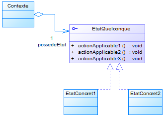

# Bienvenue

Bonjour à tous. Ce playground va servir à présenter et expliquer ce qu'est le design pattern State.

# Design Pattern

Les design patterns sont des méthodes souvent utlisées lors du développement logiciel. Ils permettent d'optimiser, de clarifier du code informatique et de le rendre plus robuste.

Les design patterns sont regroupés en 3 grandes familles:
1. Les patterns de création
2. Les patterns de structuration
3. Les patterns comportementaux

Ici, le design pattern State fait partie de la famille des **patterns comportementaux**.

# Pourquoi la famille des patterns comportementaux ?

L'une des raisons principales est que le pattern State est utilisé pour **changer le comportement** d'un objet sans toucher à son instanciation.

Vous avez ci-dessus le diagramme de classe générique. De ce qu'on peut voir sur ce diagramme, nous avons donc un **contexte**. Ce **contexte** va donc manipuler une **interface de changement d'états**. Cette dernière héritera des différents états que pourra avoir le contexte.

Le **contexte** ne changera donc pas d'instanciation, mais son **comportement**, traduit par les **différents états** qui le composent, changera complètement.

# Autre chose ?

Ce Design Pattern est quelque peu compliqué. Pour illustrer tout cela, je vous invite à vous rendre sur la page suivante comportant un exemple dans son intégralité.
